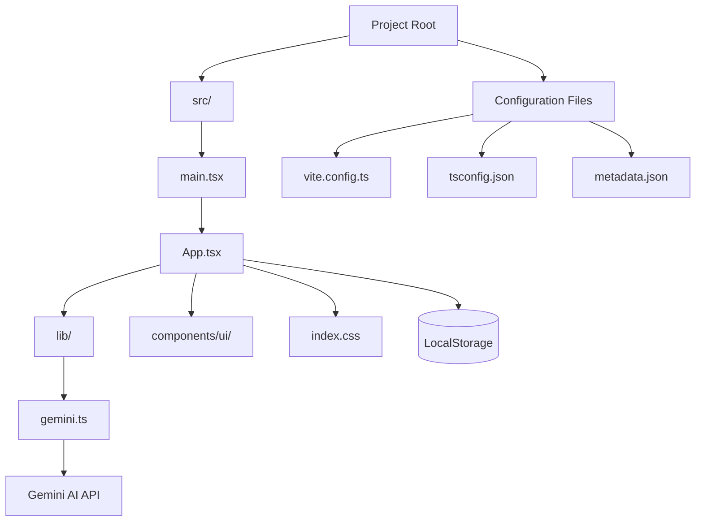

# Motion Intelligence Performance 

An advanced fitness intelligence system that acts as a professional sports scientist, performance analyst, and personal running coach combined.

## 🔗 Live Demo
[View Live Application](https://ais-dev-dg7ogjc2s3px5g6s6dqxrr-47418378330.asia-east1.run.app)

## Features

- **AI Workout Analysis**: Deep biomechanical reasoning using Gemini AI.
- **Granular Telemetry**: Track distance, time, pace, heart rate, cadence, and RPE.
- **Progress Analytics**: Local persistence of session history and volume tracking.
- **Immersive UI**: High-octane, sporty dashboard with real-time visualizations.
- **Injury Risk Assessment**: Intelligent risk scoring based on workload and recovery.

## Project Structure

### Directory Breakdown

- `src/App.tsx`: The core application logic, state management, and UI layout.
- `src/lib/gemini.ts`: Integration with the Google Generative AI SDK for performance analysis.
- `src/components/ui/`: Reusable shadcn/ui components (Buttons, Inputs, Sliders, etc.).
- `src/index.css`: Global styles, Tailwind CSS configuration, and the "Immersive UI" theme.
- `metadata.json`: Application metadata and permissions.

## Tech Stack

- **Framework**: React 19 + Vite
- **Styling**: Tailwind CSS v4
- **Animations**: Framer Motion (motion/react)
- **Icons**: Lucide React
- **AI Engine**: Google Gemini 1.5 Pro
- **Components**: shadcn/ui

---

**Developed and Authored by Jayalle Pangilinan**
